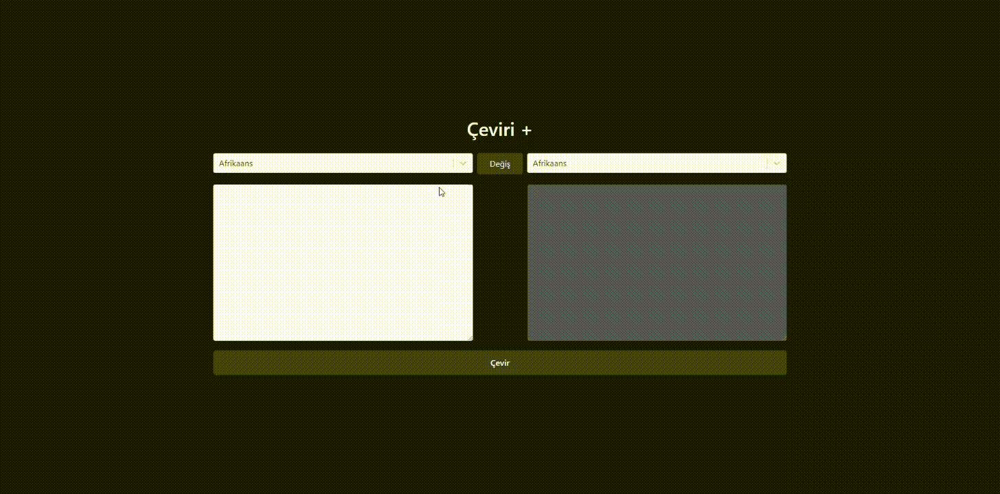

# Translate App

This project is a Translation Application that allows users to translate text between different languages. Users can select the source and target languages to translate their text.

## Features

- **Source and Target Language Selection**: Users can choose both the source and target languages for translation.
- **Text Input and Translation Result**: Text fields are provided for inputting text and displaying translation results.
- **Swap Button**: Allows users to swap the source and target languages with a single click.
- **Translate Button**: Executes the translation process.

## Libraries and Technologies

- **JavaScript**
- **Axios**
- **@reduxjs/toolkit**
- **React-Redux**
- **React-Select**
- **TailwindCSS**

## Preview

